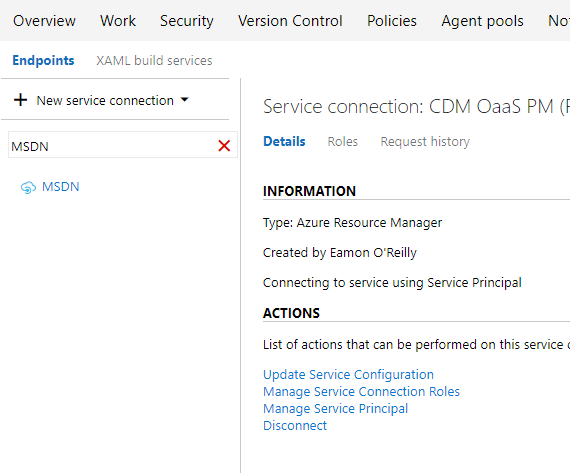
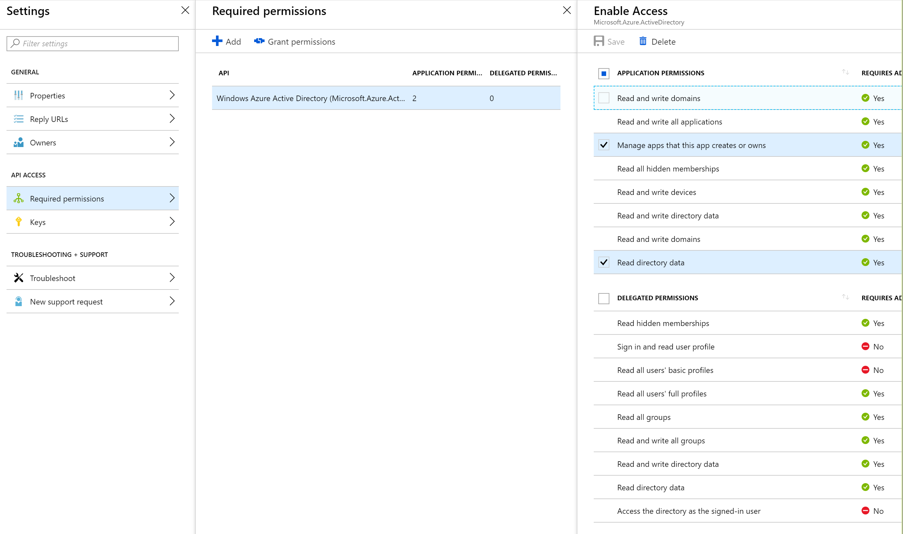
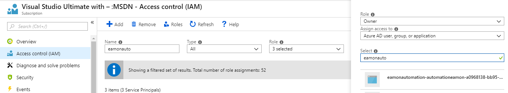
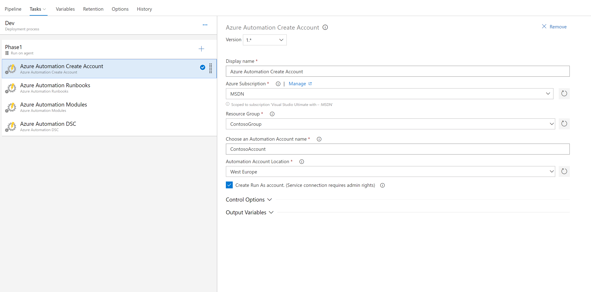

# Create Azure Automation Account

This task creates an Azure Automation account in the specified subscription that the azure service connection is configured for. You can get a list of supported regions by reviewing the [Azure region list for Automation](https://azure.microsoft.com/en-us/global-infrastructure/services/?products=automation).
It supports creating a new resource group also if one is not already created.

## RunAs Account
The task supports creating a [RunAs account](https://docs.microsoft.com/en-us/azure/automation/manage-runas-account) for Azure Automation. In order to create an account, the service connection created for the subscription must have the following permissions added to it.
* Permission to create and query Azure AD. You can set this up by clicking on Manage Service Prinicpal 

* Add permissions to the service principal to query Windows Azure Active Directory. (Manage apps that this app creates or owns and Read directory data)

* Click Grant permissions to give tha application permissions.
* Add this service prinicpal as an owner on the subscription. This is required so that it can add the new RunAs service principal as a contributor on the subscription.

## Configuring the task

You can configure the task by selecting the service connection and filling in the required values as shown below:

