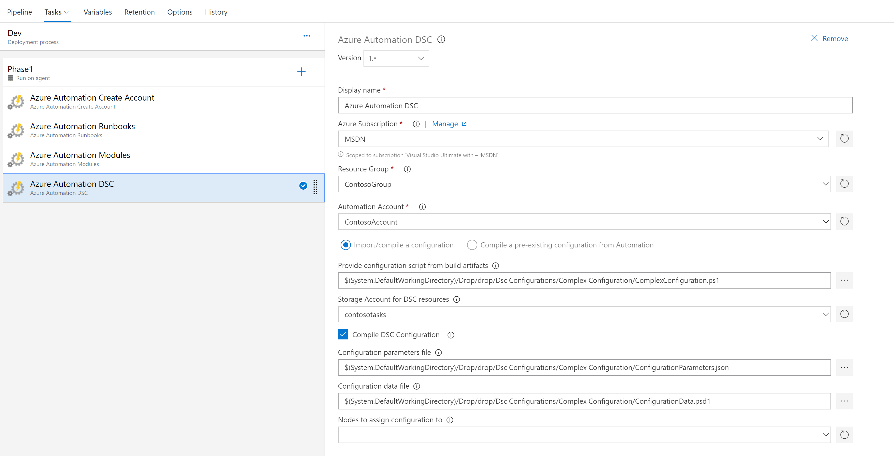

# Import and optionally compile / assign configurations
This task will import a configuration and optionally compile the configuration. Any dependent modules will be imported from the PowerShellGallery.com

The task enables importing configurations from the drop location in Azure DevOps or compiling an existing configuration from an Automation account. If the configuration in source control contains references to modules with resources from the PowerShellGallery.com, then these modules will be automatically imported into the Automation account to ensure a valid compilation. If dsc resources exist in custom modules, these should be imported using the Import Modules task to ensure they are available before the configuration is compiled. The task also takes an optional parameters file defined in json like the following:

```json
{
    "FeatureName": "PSWAWebServer",
    "IsPresent": "true"
}
```
A configuration data can also be passed into the compilation by referencing a psd1 file in source control.



