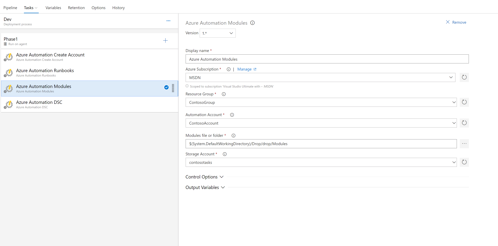

# Import modules
This task enables importing modules from the drop location in a DevOps pipeline. It requires a storage account to copy the modules to so they can be imported into Azure Automation. It will create the storage account and modules container if they do not exist.

