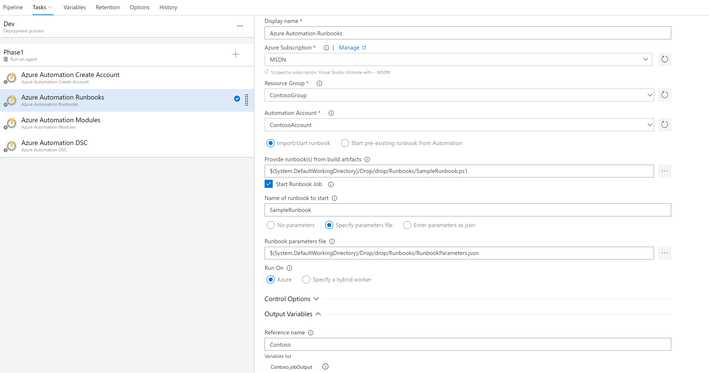

# Import and optionally start an Azure Automation runbook.

This task imports a single runbook or a group of runbooks in a folder into an Azure Automation Account. It can also optionally start the runbook after import with a set of required parameters.

## Import / Start runbook option
This option enables importing of runbooks from a drop location creating as part of a build task. If the Start Runbook job checkbox is enabled, then it will also start a runbook that was imported with a set of parameters either specified in the task or as a json file. The syntax for the json parameters is the following:

```json
{
    "FirstName": "Hello",
    "LastName" : "World"
}
```

## Start pre-existing runbook 
The task also enables the starting of a runbook job from an existing Automation account. This is useful if you need to define a list of tasks and make these available to devops pipelines during deployment or continous operations.

## Run On
The task enables running the job in either Azure Automation or on a designaged hybrid [runbook worker group](https://docs.microsoft.com/en-us/azure/automation/automation-hybrid-runbook-worker).



## Get output from a job
The tasks will also publish the output from a job so that it is available for other tasks to use in their processes. You can configure this by adding an optional reference and then it can be referenced by using $Env:reference_jobOuput